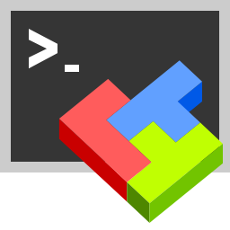

<h1 align="center">
  
   
  MobaXterm
</h1>

<b>This is the snap for MobaXterm</b>

MobaXterm is a free and advanced terminal for Windows, providing an all-in-one network application with an embedded X server, tabbed SSH client, and many other network tools for remote computing.

<!-- Uncomment and modify this when you are provided a build status badge

-->

## Install

`sudo snap install mobaxterm-wine`

([Don't have snapd installed?](https://snapcraft.io/docs/core/install))

Published for  with :gift_heart:

<!-- 
## The Snapcrafters

|  |
| :---: |
| [Your Name](https://github.com/yourname/) |
--> 

<!-- Uncomment and modify this when you have upstream contacts
## Upstream

|  |
| :---: |
| [Upstream Name](https://github.com/upstreamname) |
-->
