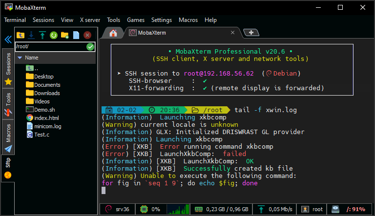

<h1 align="center">
  
   
  HeidiSQL
</h1>

<b>This is the snap for HeidiSQL</b>

HeidiSQL is free software, and has the aim to be easy to learn. "Heidi" lets you see and edit data and structures from computers running one of the database systems MariaDB, MySQL, Microsoft SQL, PostgreSQL and SQLite. Invented in 2002 by Ansgar, HeidiSQL belongs to the most popular tools for MariaDB and MySQL worldwide.

<!-- Uncomment and modify this when you are provided a build status badge

-->

## Install

    sudo snap install heidisql-wine

([Don't have snapd installed?](https://snapcraft.io/docs/core/install))

Published for  with :gift_heart:

<!-- 
## The Snapcrafters

|  |
| :---: |
| [Your Name](https://github.com/yourname/) |
--> 

<!-- Uncomment and modify this when you have upstream contacts
## Upstream

|  |
| :---: |
| [Upstream Name](https://github.com/upstreamname) |
-->
